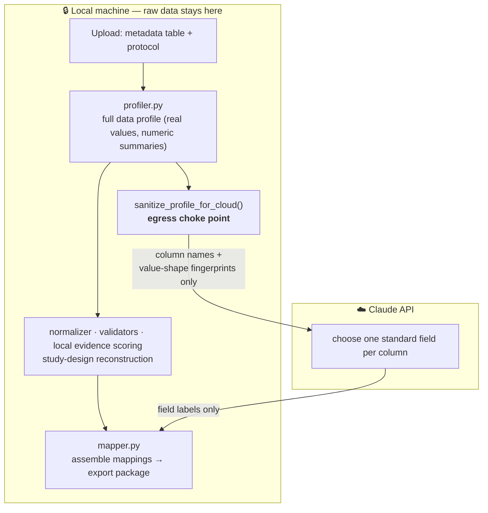

# BioSift

[](https://github.com/ums2026/biosift/actions/workflows/ci.yml)

[](LICENSE)

**Privacy-preserving biomedical metadata curation.** BioSift turns cryptic
experimental metadata and a study protocol into a standardized, reviewable,
analysis-ready package — using a cloud LLM (Claude) to interpret columns while
**guaranteeing that no experimental or patient data ever leaves your machine.**

The engineering centerpiece is a hard **data-egress boundary**. Assisting an LLM
and protecting sensitive data usually pull against each other; BioSift reconciles
them by sending the model only column names and *content-free value-shape
fingerprints*, and running every operation that touches real values —
normalization, validation, study reconstruction, and evidence scoring — locally.
The boundary is enforced by a single choke point and asserted by a test.

## Highlights

- **Hard data-egress boundary** — all cloud-bound data passes through one
  function, `sanitize_profile_for_cloud()`, and an invariant test fails the build
  if a raw value could ever leak.
- **Privacy-preserving feature engineering** — one-way value-shape fingerprints
  (letters → `x`, digits → `9`, e.g. `D1` → `x9`) let the model disambiguate an
  identifier column from a binary category from a number-with-unit, without ever
  seeing a value.
- **Typed, structured LLM output** — the Anthropic Messages API with Pydantic
  Structured Outputs (`client.messages.parse`) returns a validated schema, not
  free text.
- **Transparent, auditable scoring** — evidence scores are computed locally from
  four weighted components, not returned as an opaque number.
- **Graceful degradation** — a fully offline, rule-based mode runs with zero
  network calls when no API key is present.
- **Domain-aware validation** — detects subject leakage across train/test splits,
  treatment–batch confounding, duplicate identifiers, and missing design cells.

## Demo


## Architecture



Only sanitized schema crosses into the cloud; only field labels come back. When
no key is present, the `sanitize → Claude` hop is skipped entirely and the
offline mapper fills the same role locally.

## What the demo detects

The built-in study intentionally contains:

- A duplicated sample identifier
- Donor-line leakage between train and test sets
- Treatment-batch confounding
- Inconsistent condition, treatment, and time-point labels
- Missing treatment metadata
- A missing experimental design combination

## Privacy model

BioSift is built so that your experimental and patient data never leaves the
machine it runs on.

- **Cell values, numeric summaries, and protocol text are never transmitted.**
  All value normalization, study-design reconstruction, quality validation, and
  evidence scoring run locally.
- **The only thing sent to Claude is sanitized column schema** — column names,
  non-identifying aggregate statistics (inferred data type, missing fraction,
  unique count), and a **content-free value-shape fingerprint** for each column.
  The fingerprint describes value *shape*, not content: masked format templates
  (every letter becomes `x`, every digit becomes `9`, so `D1` → `x9` and
  `trametinib` → `x…`), a cardinality bucket, and boolean character-class flags
  (e.g. "a measurement unit was detected"). No original value can survive
  masking. Everything passes through a single choke point,
  `sanitize_profile_for_cloud()` in `biosift/mapper.py`.
- **Claude's role is narrow:** given only that schema and the shape fingerprints,
  it chooses the standard field for each column. Nothing else.

Without a key, BioSift runs fully offline with no network calls at all.

## Claude behavior

BioSift automatically uses Claude whenever an Anthropic API key is available. You
can provide a key in either of two ways:

1. Put `ANTHROPIC_API_KEY` in `.env`.
2. Paste a key into the password field in the Streamlit sidebar.

There is no separate “enable AI” switch. With a key, Claude performs **only**
semantic column-to-field mapping from schema and value-shape fingerprints — the
shape signals let it disambiguate cryptic column names (an identifier-shaped
column vs. a binary category vs. a number with a unit) without ever seeing a
value. Everything else — normalization, study-design reconstruction, evidence
scoring, and human-review flagging — happens locally.

For live demos, the optional fallback setting can keep the app usable if an API
request fails. The interface always displays which engine produced the current
result.

## Evidence scores

The displayed score is an **evidence-strength score**, not a calibrated
probability that a mapping is correct. **It is always computed locally**, whether
Claude or the offline mapper selected the field.

The application evaluates four evidence components from 0 to 1 on-machine, using
your real data and protocol:

- 45% column-name evidence
- 30% observed-value evidence
- 20% protocol support
- 5% data-type compatibility

The application performs the weighted arithmetic so the total is internally
consistent. Scores below 80% are automatically marked for review. When Claude
mode is active, Claude contributes the field choice; the score itself never
depends on data leaving the machine.

## Run locally

### macOS or Linux

```bash
python3 -m venv .venv
source .venv/bin/activate
pip install -r requirements.txt
cp .env.example .env
streamlit run app.py
```

### Windows PowerShell

```powershell
py -m venv .venv
.venv\Scripts\Activate.ps1
pip install -r requirements.txt
Copy-Item .env.example .env
streamlit run app.py
```

Open the local URL printed by Streamlit, normally `http://localhost:8501`.
Select **One-click demo**, then press **Analyze study**.

## Enable the full AI workflow

Put an API key in `.env`:

```text
ANTHROPIC_API_KEY=your_key_here
ANTHROPIC_MODEL=claude-opus-4-8
```

Restart Streamlit. The sidebar will show **Claude mode active**, and pressing
**Analyze study** will use Claude automatically.

The implementation uses the Anthropic Messages API with Pydantic Structured
Outputs (`client.messages.parse`). The request carries only sanitized column
schema plus content-free value-shape fingerprints, and the response schema is a
fixed list of column-to-field mappings.

You may change `ANTHROPIC_MODEL` to another Claude model that supports Structured
Outputs (for example `claude-opus-4-8`).

## Run tests

```bash
pytest -q
```

The test suite covers the offline demo, planted validation issues, score display,
the privacy guarantee that no data or protocol text reaches the cloud payload,
local scoring of Claude-selected mappings, and automatic Claude selection when a
key is present.

## Project structure

```text
biosift/
├── app.py                     # Streamlit UI
├── requirements.txt
├── pyproject.toml             # pytest, ruff, and mypy config
├── LICENSE
├── .env.example
├── .github/workflows/ci.yml   # lint + tests on every push / PR
├── .streamlit/config.toml
├── biosift/
│   ├── demo_data.py           # synthetic study with planted issues
│   ├── document_parser.py     # protocol PDF/TXT extraction (local)
│   ├── exporter.py            # reproducible analysis package
│   ├── mapper.py              # egress boundary + Claude / offline mapping
│   ├── models.py              # Pydantic domain models
│   ├── normalizer.py          # raw → canonical value normalization (local)
│   ├── profiler.py            # dataframe profiling (local)
│   └── validators.py          # leakage / confounding / duplicate detection
└── tests/
    └── test_biosift.py
```

## Development

The project is configured for `ruff` (lint + format) and `mypy` (type checking)
via `pyproject.toml`. CI runs lint and tests on Python 3.11 and 3.12.

```bash
pip install ruff mypy
ruff check .        # lint (matches CI)
ruff format .       # auto-format
mypy biosift        # optional static type checking
pytest -q           # tests
```

## Deployment

### Streamlit Community Cloud

1. Push this folder to GitHub.
2. Create a Streamlit Community Cloud app with `app.py` as the entry point.
3. Add `ANTHROPIC_API_KEY` and `ANTHROPIC_MODEL` to the app secrets.

### Hugging Face Spaces

Use a Streamlit-compatible Docker Space, or convert the frontend to Gradio.
Streamlit Community Cloud is the simplest path.

## Safety and scope

This is a research-data curation demonstration. It does not diagnose disease,
recommend treatment, or replace scientific review. AI-generated mappings must be
reviewed before use in real research pipelines.

## License

Released under the [Apache 2.0 License](LICENSE).
